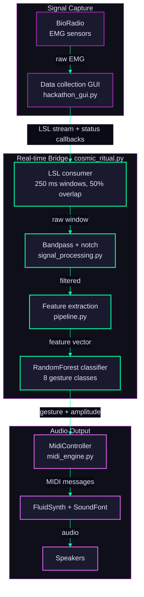
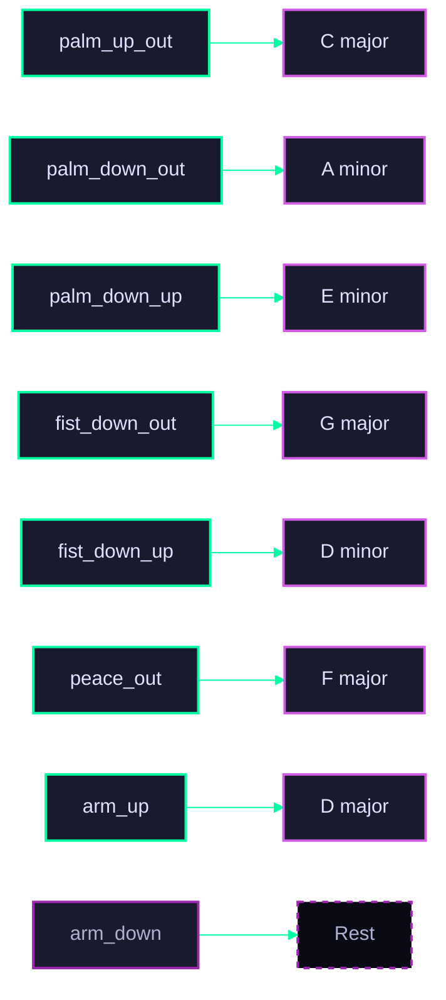
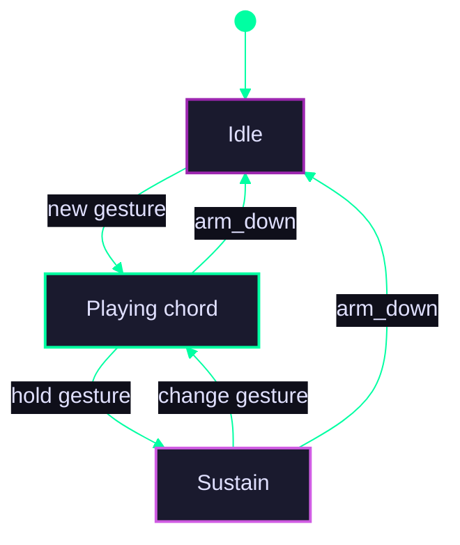

# :material-sitemap: Architecture

## System overview

---

## Signal flow

| Stage | File | What it does |
|---|---|---|
| **Capture** | <nobr>`hackathon_gui.py`</nobr> | PyQt6 GUI that streams raw EMG from BioRadio serial, an LSL inlet, or a mock source. Records labeled CSVs and hosts the Music Mode toggle that starts the real-time bridge. |
| **Real-time bridge** | <nobr>`cosmic_ritual.py`</nobr> | Consumes the LSL stream, windows the samples (250 ms, 50% overlap), classifies each window, and feeds the MIDI engine. Reports connection + classifier status back to the GUI via callbacks. Falls back to `SimpleFeatureClassifier` if `models/classifier.pkl` is missing. |
| **Preprocessing** | <nobr>`signal_processing.py`</nobr> | Bandpass filter (20-450 Hz) to isolate the EMG band, plus a 60 Hz notch to kill power-line interference. |
| **Feature extraction** | <nobr>`pipeline.py`</nobr> | Five time-domain features per window: RMS, MAV (mean absolute value), variance, waveform length, zero crossings. |
| **Classification** | <nobr>`pipeline.py`</nobr> | `RandomForestClassifier` trained on the team's labeled CSVs under `data/`. Five other variants (KNN, LDA, SVM, XGBoost, Ensemble) ship under `models/` for offline comparison. |
| **Music synthesis** | <nobr>`midi_engine.py`</nobr> | Gesture-to-chord and gesture-to-instrument mapping, state machine, FluidSynth driver. Auto-selects WASAPI / DirectSound / WaveOut on Windows. |

---

## Gesture mapping

### Right hand: chord selection

`arm_down` is the explicit silence gesture. It stops any held chord and returns the engine to idle.

### Left hand: instrument selection

| Gesture | Instrument |
|---|---|
| `fist_down_out` | Piano |
| `palm_up_out` | Nylon Guitar |
| `palm_down_out` | Steel Guitar |
| `palm_down_up` | Electric Guitar |
| `fist_down_up` | Strings |
| `peace_out` | Pad (Warm) |
| `arm_up` | Nylon Guitar |
| `arm_down` | Nylon Guitar |

Left-hand gestures share the same eight-gesture vocabulary as the right hand but map onto six General MIDI programs. The classifier is one model trained on muscle activity at the forearm; which hand is "left" or "right" is a convention enforced at the engine layer.

---

## MIDI engine internals

The state machine **debounces** noisy classifier output (default: 3 consecutive same-gesture frames before triggering a transition) and **handles chord transitions cleanly** by firing note-off on the outgoing chord before note-on on the incoming one.

**Velocity mapping.** EMG amplitude (0.0-1.0) maps linearly to MIDI velocity in the range **40-127**. The floor of 40 ensures soft gestures stay audible while preserving dynamic range for tense ones.

**Dynamic re-voicing.** During the `Sustain` state, amplitude updates re-voice the held notes at the new velocity. Squeeze harder mid-chord and the held notes swell in real time without re-triggering note-on.

**Audio driver fallback.** On Windows, the engine attempts **WASAPI** first (lowest latency), falling back to **DirectSound** then **WaveOut** if WASAPI is unavailable. Linux + macOS use the platform default through `pyfluidsynth`.

---

## Key files

| File | Purpose |
|---|---|
| <nobr>`src/midi_engine.py`</nobr> | MIDI engine: state machine, `MidiController`, FluidSynth driver, playlist loader |
| <nobr>`src/cosmic_ritual.py`</nobr> | Real-time bridge: LSL consumer, windowing, classifier call, GUI status callbacks |
| <nobr>`src/midi_demo.py`</nobr> | Standalone audio smoke test: cycles instruments and chords through FluidSynth |
| <nobr>`src/pipeline.py`</nobr> | ML pipeline: feature extraction + classifier training entry point |
| <nobr>`src/pipeline_v2.py`</nobr> | Iteration of the pipeline with a richer feature set + classifier comparison |
| <nobr>`src/realtime_process.py`</nobr> | Realtime processing helpers (windowing, debounce, amplitude estimation) |
| <nobr>`src/hackathon_gui.py`</nobr> | PyQt6 data-collection GUI + LSL streamer + Music Mode toggle |
| <nobr>`src/signal_processing.py`</nobr> | Filters, EMG features, EOG / GSR / IMU utilities (kept from the hackathon starter) |
| <nobr>`models/classifier.pkl`</nobr> | Active classifier loaded by the real-time bridge |
| <nobr>`models/classifier_*.pkl`</nobr> | KNN / LDA / RF / SVM / XGB / Ensemble variants for offline comparison |
| <nobr>`playlist/*.json`</nobr> | Per-song chord progressions (6 songs) |
| <nobr>`soundfonts/GeneralUser_GS.sf2`</nobr> | FluidSynth SoundFont (~30 MB, bundled) |

---

## Latency budget

End-to-end latency from a muscle activation to audible MIDI output:

| Stage | Approx. time |
|---|---|
| EMG sample to BioRadio buffer | 4-10 ms (sensor + Bluetooth serial) |
| BioRadio to LSL stream | < 5 ms |
| 250 ms window collection | 125 ms (with 50% overlap, classifier fires every 125 ms) |
| Feature extraction + classification | < 5 ms (RandomForest, ~5 features) |
| Debounce (3 frames default) | up to 375 ms additional |
| `MidiController.on_classification()` -> note-on | < 1 ms |
| FluidSynth render -> WASAPI | typically < 10 ms |

The dominant term is the window + debounce path. Reducing window size or debounce count trades responsiveness for classifier stability; the defaults are the team's tuned compromise.
